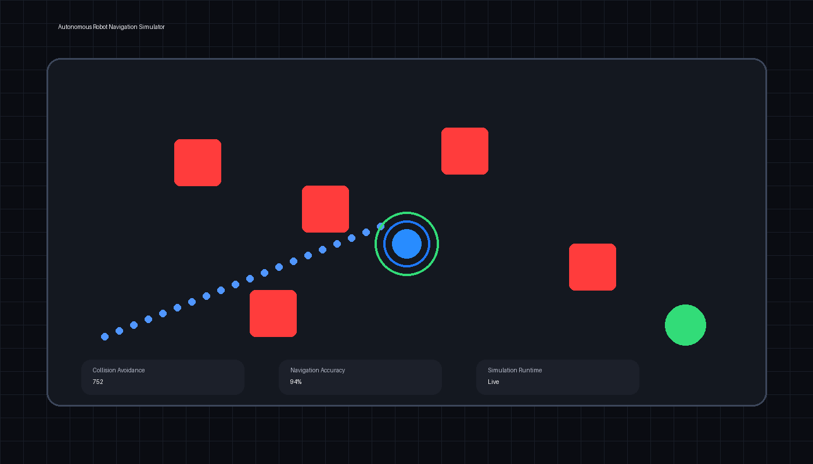

# Autonomous Robot Navigation Simulator

A browser-based robotics simulation project focused on autonomous navigation, obstacle avoidance, and real-time movement visualization.

The simulator demonstrates how robotic systems can navigate dynamic environments while avoiding collisions and continuously evaluating path behavior.

<div align="center">

  

  <p>
    Real-time robot navigation and obstacle avoidance simulation built using HTML, CSS, and JavaScript.
  </p>

</div>

---

## Features

- Autonomous robot movement
- Obstacle avoidance simulation
- Collision detection logic
- Real-time rendering
- Navigation metrics visualization
- Lightweight browser-based simulation

---

## Tech Stack

- HTML
- CSS
- JavaScript
- Canvas API

---

## Project Structure

```bash
autonomous-robot-navigation-simulator/
│
├── index.html
├── style.css
├── script.js
├── README.md
└── Images/
      └── navigation-preview.png
```

---

## Run Locally

Clone the repository:

```bash
git clone https://github.com/shanmukh-pilla/autonomous-robot-navigation-simulator.git
```

Open the project folder:

```bash
cd autonomous-robot-navigation-simulator
```

Run using VSCode Live Server or directly open:

```bash
index.html
```

---

## Future Improvements

- Advanced pathfinding algorithms
- Multi-robot coordination
- Sensor simulation
- Dynamic obstacle movement
- Telemetry dashboard integration
- ROS integration concepts